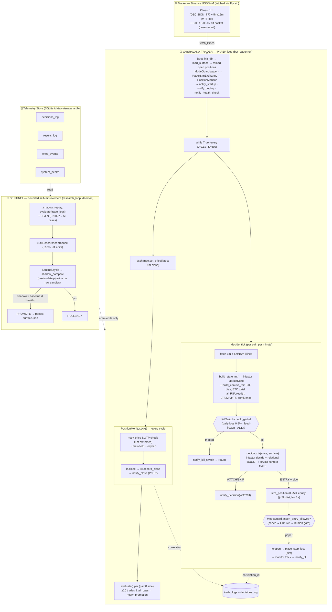
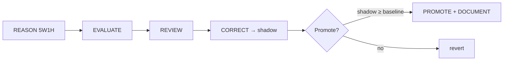

<div align="center">


# 🪙 Project Vaiśravaṇa

### A stability-first, high-win-rate crypto-futures trading system

[](docs/34-implementation-status.md)
[](docs/34-implementation-status.md)
[](docs/30-concrete-spec.md)
[](docs/25-safety-shadow-rollback.md)
[](docs/30-concrete-spec.md)
[](docs/30-concrete-spec.md)
[-blue)](docs/41-improvements.md)
[](#no-signals)
[](docs/22-telemetry.md)
[](#attribution)
[](ARCHITECTURE.md)

*Named after **Vaiśravaṇa (वैश्रवण)** — Buddhist deity of wealth and guardian of the northern quarter.
The system's prime directive is the **preservation** of capital through stable, high-probability execution.*

</div>

---

> [!NOTE]
> **Design docs + tested implementation.** 35 interlinked design documents *plus* a tested
> Python implementation (`src/`, 133 offline tests): 9 engines → two-layer gate → paper
> execution → evaluation → bounded Sentinel → promotion gate (human-approved) → monitoring.
> Status: [docs/34-implementation-status.md](docs/34-implementation-status.md). PAPER-only —
> no live path exists without explicit human approval (now enforced structurally by
> [docs/41-improvements.md](docs/41-improvements.md)).
>
> ⚠️ **Quant review (2026-07-26):** [docs/40-quant-review.md](docs/40-quant-review.md) found
> a live-vs-design gap — several safety/execution features lived in `src/` but were **not
> wired into the running bot**. The highest-value gaps are now closed (real kill-switch,
> real risk sizing, real structure/liquidity flags); real stop-loss placement and a hard
> mode boundary remain P0. Read the review before trusting the documented safety posture.

## ✨ Why Vaiśravaṇa

| ❌ Typical bot failure | ✅ Vaiśravaṇa's answer |
|------------------------|------------------------|
| Reads one candle / one indicator | **Multi-evidence confluence** before any entry |
| Waits for external signals | **No signals** — decides internally, enters immediately |
| Dies on execution quirks | **Production-hardened** order validation & 1000× handling |
| Blind self-tuning | **Bounded** Sentinel + 5W1H reasoning, fully logged |
| No audit trail | **Every** decision, fill, TP, close, win/loss persisted |

## 🎯 Non-Negotiable Goals

| # | Goal | Measure |
|---|------|---------|
| **G1** | Time-sensitive accuracy | Decision→fill < 2s |
| **G2** | Stability | Max drawdown < 3% (unreal & live) |
| **G3** | High win rate (≥85%) | Per-pair/per-TF shadow WR ≥ 85% to go live |
| **G4** | Micro-timeframe trades | 5m / 10m / 15m windows |
| **G5** | All Binance pairs | Full USDT-perp universe, liquidity-filtered |
| **G6** | Shadow-first | Every win/loss recorded in unreal before live |

---

## 🏛️ Architecture at a Glance

Two cooperating processes share one telemetry store: the **Trader** (PAPER, deployed on
Fly) makes decisions every minute; the **Sentinel** (offline, propose-only by default)
reviews results and may promote a *bounded* parameter change via a genuine shadow replay.



> **Key invariant (doc 21):** the Sentinel edits *only* the bounded `ParameterSurface`
> (weights, thresholds, SL/TP multipliers, leverage, cooldown) — never engine logic.
> Live trading is structurally impossible without `promotion_gate(human_approved=True)`
> (enforced by `ModeGuard`). The Trader is **PAPER**: every fill/stop is simulated on
> `PaperSimExchange`, and the `PositionMonitor` manages SL/TP/max-hold from mark price.

### End-to-end walkthrough (one decision cycle)

1. **Boot** (`bot_paper.run`): opens the SQLite store, loads the persisted `ParameterSurface`
   (or defaults), reloads any open positions from `trade_logs` (restart-safe), builds the
   `ModeGuard` (PAPER → `PaperSimExchange`), and fires the **startup + deploy + health-check**
   Telegram cards (doc 43). If `VAISRAVANA_LLM != off`, a daemon `research_loop` thread starts.
2. **Per minute, per pair** (`_decide_tick`):
   - Fetch the latest **1m** (decision TF) candles + **5m/15m** (MTF context) + the
     cross-asset basket (BTC leader, BTC.d risk regime, alt RS/breadth).
   - `build_state_mtf` → a 7-factor `MarketState`; `build_context_for` folds the
     cross-asset/MTF relational context into it.
   - **Kill-switch gate**: trip on daily loss ≥ 0.5%, frozen feed, or ADL ≥ 4 → notify + skip.
   - `decide_ctx` = 7-factor `decide()` **+ relational boost (clamped)** **+ hard context gate**
     (don't fight BTC-bearish / risk-off; require LTF/MF/HTF confluence or pullback-to-anchor).
     `Σweights = 1.0` is preserved (doc 21) — context only *modulates*, never adds a new weight.
   - If **ENTRY + side**: `size_position` (0.25% equity at the SL distance, leverage 3×) →
     `lc.open` → `place_stop_loss` on the sim exchange → `monitor.track` → `notify_fill`.
     If **WATCH/SKIP**: a `notify_decision` is sent (so you see *why* it sat out).
3. **Every cycle** (`PositionMonitor.tick`): the latest 1m close is pushed to the sim exchange;
   the monitor checks mark-price SL/TP, max-hold, and orphan positions, then `lc.close`,
   records the daily-loss book, and `notify_close` (with R-multiple PnL).
4. **Every 30 min**: `_report_status` evaluates each (pair,tf,side) and posts a summary card;
   when a series reaches ≥20 trades and passes all gates, `notify_promotion` flags it
   **SHADOW READY — needs human approval to go live**.
5. **Sentinel (background)**: reads `trade_logs`, builds FP/FN cases, proposes a bounded
   surface change, and only promotes if a **genuine shadow replay** (`shadow_compare` on raw
   candles) beats the baseline. Promoted surfaces are persisted to `surface.json` and reloaded
   on the next restart.

The **9 engines + 1 reasoning layer** are detailed in
[`docs/11-bot-architecture.md`](docs/11-bot-architecture.md) and
[`docs/29-dynamic-reasoning-5w1h.md`](docs/29-dynamic-reasoning-5w1h.md). The master design
lives in [`ARCHITECTURE.md`](ARCHITECTURE.md). Cross-asset/MTF context is in
[`docs/42-context-mtf-scalping.md`](docs/42-context-mtf-scalping.md).

---

## 🪢 No Signals

<details>
<summary><b>Click to expand — the "no external signal" design choice</b></summary>

The bot **does not wait for, parse, or depend on any external source** (Telegram, webhook, API
signal). It watches the market itself, scores internally via the 9 engines, and **enters
positions immediately** when the confluence gate passes.

This removes an entire failure class:
- signal-source downtime
- parse / regex errors
- delayed or duplicate messages
- "front-running" the signal

The internal decision is persisted to **`decisions_log`** (with a `confidence_pct` column)
*after* the trade is already in — replacing the traditional `signals_log` entirely.

</details>

## 📊 Logging & Auditability

Three mandatory tables (full SQL in [`docs/30-concrete-spec.md §4`](docs/30-concrete-spec.md)):

| Table | Purpose |
|-------|---------|
| **`trade_logs`** | One row per trade that entered. Lifecycle timestamps (`ts_filled`, `ts_tp_hit`, `ts_fully_closed`), **`win`/`loss` booleans**, cumulative **`win_pct`/`loss_pct`** per (pair×tf×side). *Every* trade recorded. |
| **`decisions_log`** | Internal decision + **`confidence`%**. The trade is already "in" when written. |
| **`results_log`** | Historical meta-loop trail: **evaluation / reasoning / thinking / correction / improvement / review**. |

A `correlation_id` threads every table, so a single trade's full life is reconstructable.

[](docs/22-telemetry.md)
[](docs/30-concrete-spec.md)
[](docs/26-documentation-output.md)

### 📟 Monitoring & DB awareness (Telegram)

The bot pushes live cards to Telegram so you never have to SSH in to know its state.
Every card is HTML-formatted (raw `v0.0.9`, no backslashes / em-dashes; doc 43):

| Card | When | Contents |
|------|------|----------|
| 🤖 **Startup** | every (re)deploy | version, pairs, decision/context TFs, cycle, mode, LLM, open positions |
| 🚀 **Deploy** | every (re)deploy | version + changelog of what shipped |
| 💓 **Health check** | every (re)deploy | liveness, region, open positions, UTC time |
| 🗄️ **Database** | **boot + every 30m** | **overall win rate** (W/L/closed), **DB size on disk**, **total rows**, and **per-table row counts** (trade_logs / decisions_log / results_log / exec_events / system_health) |
| 📊 **Status (30m)** | every 30m | leads with **WR total** + a compact **DB size · rows** line, then per-(pair,tf,side) WR/expectancy |
| 🟢 **Decision / fill / close** | per event | entry/SL/TP, R-multiple PnL, win/loss |
| 🚀 **Promotion** | ≥20 trades & gates pass | flags a series SHADOW READY (needs human approval to go live) |
| 🛑 **Kill-switch** | on trip | reason (daily-loss / frozen feed / ADL) |

> The **Database** card is the one to watch for storage: it reports the true on-disk footprint
> (main DB + `-wal` + `-shm` sidecars) so you can see the SQLite volume grow before it becomes
> a problem. The overall win rate is portfolio-wide (across *all* closed trades), distinct from
> the per-(pair,tf,side) win rate used by the 85% promotion gate.

---

## 🔧 The Sentinel (autonomous self-improvement)

> [!IMPORTANT]
> The Sentinel **never rewrites engine logic**. It edits only a *bounded parameter surface*
> (weights, thresholds, SL/TP multipliers, leverage, cooldown) — always via shadow-test →
> promote → document.



Guardrails forbid disabling safety filters or reward-hacking (optimising a metric at the
expense of genuine stability). See [`docs/24-review-correction-bot.md`](docs/24-review-correction-bot.md)
and [`docs/25-safety-shadow-rollback.md`](docs/25-safety-shadow-rollback.md).

---

## 🛡️ Stability-First Risk Posture

| Guard | Value |
|-------|-------|
| Max leverage | **3×** (hard cap, tuned for scalping; doc-21 bounds) |
| Daily loss limit | **0.5%** → kill-switch |
| Risk per trade | **0.25%** of equity (real `size_position`, not hardcoded) |
| Global live pairs cap | **5** |
| Max hold | 60 bars (1m) / trade timeframe |
| Kill switches | daily-loss · ADL rank · funding spike · maintenance · frozen feed · black-swan |

> [!WARNING]
> The **+85% win-rate is a gate, not a guarantee.** Pair/timeframe combinations that cannot
> sustain 85% in unreal are *pruned*. Capital is never forced into sub-85% setups.

---

## 📚 Documentation

<details open>
<summary><b>📖 Master Design</b></summary>

| File | Role |
|------|------|
| [**ARCHITECTURE.md**](ARCHITECTURE.md) | **Master design** — goals, principles, component map, MT shadow engine, win-rate strategy |
|| [**docs/33-paper.md**](docs/33-paper.md) | **Technical Paper** — abstract, architecture, no-signaling, logging, Sentinel, risk |
|| [**docs/40-quant-review.md**](docs/40-quant-review.md) | **Expert crypto-quant review** — critical findings, fixes applied, improvement roadmap |
| [**docs/41-improvements.md**](docs/41-improvements.md) | Improvements from the expert review (mode boundary, real stops, honest backtest, shadow) |
| [**docs/42-context-mtf-scalping.md**](docs/42-context-mtf-scalping.md) | **Cross-asset (BTC/BTC.d/ALT) + MTF relational context + scalping tuning** |
| [**docs/43-telegram-notifier.md**](docs/43-telegram-notifier.md) | **Telegram notifier fix: MarkdownV2, clean version, no em-dash, health-check heartbeat** |

</details>

<details>
<summary><b>🧠 Part 1 — 8 Analysis Layers (Signal / Alpha)</b></summary>

| File | Content |
|------|---------|
| [docs/01-market-structure.md](docs/01-market-structure.md) | Layer 1 — Market structure (trend/range/breakout/fake) |
| [docs/02-candlestick-psychology.md](docs/02-candlestick-psychology.md) | Layer 2 — Candlestick psychology |
| [docs/03-momentum.md](docs/03-momentum.md) | Layer 3 — Momentum & overextension |
| [docs/04-volume-confirmation.md](docs/04-volume-confirmation.md) | Layer 4 — Volume confirmation |
| [docs/05-support-resistance.md](docs/05-support-resistance.md) | Layer 5 — Support / Resistance |
| [docs/06-liquidity.md](docs/06-liquidity.md) | Layer 6 — Liquidity (grabs / stop hunts) |
| [docs/07-atr.md](docs/07-atr.md) | Layer 7 — ATR (normal volatility) |
| [docs/08-multi-timeframe.md](docs/08-multi-timeframe.md) | Layer 8 — Multi-timeframe confirmation |
| [docs/09-smart-candle-analysis.md](docs/09-smart-candle-analysis.md) | Smart candle analysis + Decision Tree |
| [docs/10-scoring-system.md](docs/10-scoring-system.md) | Futures signal scoring (weights & thresholds) |
| [docs/11-bot-architecture.md](docs/11-bot-architecture.md) | Layered bot architecture (9 engines) |

</details>

<details>
<summary><b>🤖 Part 2 — Two-Bot System (Auto-Correction / Improve / Review / Evaluate)</b></summary>

| File | Content |
|------|---------|
| [docs/20-meta-system-overview.md](docs/20-meta-system-overview.md) | System overview: Trader + Sentinel, 4 phases |
| [docs/21-active-bot.md](docs/21-active-bot.md) | **Parameter surface** — what Sentinel may change (bounds) |
| [docs/22-telemetry.md](docs/22-telemetry.md) | Trade journal / log schema (Sentinel's eyes) |
| [docs/23-evaluation-engine.md](docs/23-evaluation-engine.md) | Auto-evaluate: metrics + per-factor/regime attribution |
| [docs/24-review-correction-bot.md](docs/24-review-correction-bot.md) | Auto-review + auto-correct + shadow + promote |
| [docs/25-safety-shadow-rollback.md](docs/25-safety-shadow-rollback.md) | Shadow mode, bounds, rollback, kill-switch |
| [docs/26-documentation-output.md](docs/26-documentation-output.md) | Required formats: eval_report / change_proposal / changelog / **chronicle** |
| [docs/27-feedback-loop.md](docs/27-feedback-loop.md) | Daily loop orchestration + triggers |
| [docs/28-unexpected-factors.md](docs/28-unexpected-factors.md) | **Blind-spot research**: 8 groups of unforeseen factors |
| [docs/29-dynamic-reasoning-5w1h.md](docs/29-dynamic-reasoning-5w1h.md) | **Dynamic reasoning**: 5W1H + 5 scenarios + novel hypotheses |
| [docs/30-concrete-spec.md](docs/30-concrete-spec.md) | **CONCRETE SPEC**: stability-first, WR≥85%, micro-TF, all pairs, no signals, full schemas |
| [docs/31-glossary.md](docs/31-glossary.md) | Glossary & cross-reference |
| [docs/32-listener-lessons.md](docs/32-listener-lessons.md) | Enrichment from `learnernoearner-listener` (production patterns) |

</details>

---

## 🚀 Quick Decision Tree (entry)

> **Bidirectional** — SHORT is a first-class path, not a mirrored long. Each long condition
> has a bearish twin. Win rate ≥85% is gated **per (pair, timeframe, side)**.

```text
Regime + HTF bias (1h/4h) → pick direction:
  ├─ Bullish (uptrend, support, post-sweep) + bullish LTF candle + vol↑ + momentum
  │   + spread<5bps + ATR normal + funding ok + ADL<4  →  OPEN BUY  (SL below, TP above)
  └─ Bearish (downtrend, resistance, post-sweep-up) + bearish LTF candle + vol↑ + momentum
      + spread<5bps + ATR normal + funding ok + ADL<4  →  OPEN SELL/SHORT  (SL above, TP below)
```

## 📈 Scoring Weights (futures)

| Factor | Weight |
|--------|--------|
| Trend | 30% |
| Momentum | 20% |
| Volume | 15% |
| Market Structure | 15% |
| Liquidity | 10% |
| Volatility (ATR) | 5% |
| Funding / OI | 5% |

- **Score > 0.86** → Entry (A+ confluence, tuned for ≥85% WR; relationally gated by `decide_ctx`)
- **0.78 – 0.86** → Watchlist
- **< 0.78** → Skip

---

## 🤝 Attribution

> [!TIP]
> The README hero image — *"The northern Vaiśravaṇa, Lingsheng Temple"* — is a
> **public-domain (CC0 1.0)** photograph from
> [Wikimedia Commons](https://commons.wikimedia.org/wiki/File:The_northern_Vai%C5%9Brava%E1%B9%87a,_Lingsheng_Temple.jpg).
> No attribution required; included here as the project's namesake.

## 📌 Status

> [!CAUTION]
> **Not financial advice.** This is a research/design knowledge base + deployed PAPER
> trading bot. Trading crypto futures carries total-loss risk. The system is
> **code-complete and PAPER-deployed on Fly.io** (no live orders; promotion to live
> requires human approval). It is validated by 125 offline tests, a real-data backtest,
> and an honest shadow replay — but has **not** met the 200-trade ≥85% WR promotion
> stats (an operating milestone, not a code claim). Live cutover, fee-tier calibration,
> and the concrete DB choice remain open decisions (tracked in
> [`docs/31-glossary.md`](docs/31-glossary.md)).

---

## 💻 Code (Phase 0 → 16, PAPER-deployed)

Implemented in Python 3.11 (pytest + pydantic + stdlib `sqlite3`), deployed on Fly.io as a
PAPER bot. The full module map:

```text
src/config.py        ParameterSurface — Sentinel-editable params (doc 21) w/ bounds + Σweights=1.0
src/db.py            init_db() — telemetry schema verbatim from doc 30 §4 (5 tables)
src/engines.py       9 engines: 7 factor sub-scores + dual LONG/SHORT scoring + cross-asset/MTF
src/scoring.py       decide() + decide_ctx() (7-factor + relational boost + hard context gate)
src/marketcontext.py cross-asset + MTF relational context (BTC bias, BTC.d risk, alt RS/breadth)
src/decision.py      DecisionOrchestrator — two-layer gate → decisions_log
src/execution.py     tick/step filter rounding, size_position, validate/repair, OrderManager, SL
src/monitor.py       PositionMonitor — SL/TP/max-hold/orphan from mark price
src/mode.py          ModeGuard + PaperSimExchange — hard PAPER/live boundary
src/shadow.py        honest shadow replay (shadow_compare) for the Sentinel
src/backtest.py      HONEST backtest harness (taker fees, OOS split, expectancy/PF)
src/lifecycle.py     Trade lifecycle + rolling win/loss per (pair,tf,side)
src/evaluation.py    per-(pair,tf,side) evaluation + composite health (anti reward-hack)
src/sentinel.py      bounded self-improvement loop (propose → shadow → promote/rollback → chronicle)
src/safety.py        kill-switches + promotion gate
src/telemetry.py     central telemetry writer (fail-loud)
src/telegram_bot.py  Telegram notifier (HTML cards, health-check heartbeat, doc 43)
scripts/bot_paper.py deployable PAPER loop (Fly entrypoint)
scripts/deploy.py    versioned Fly deploy (bump → changelog → tag → push → flyctl deploy)
tests/               pytest suite — 125 passing (all mocked/offline)
```

```bash
uv venv && uv pip install -r <(uv pip compile pyproject.toml)   # or: uv pip install pydantic pytest
.venv/Scripts/python -m pytest                                  # 125 passed
```

> **Status:** All phases implemented, tested (125 passing), and **PAPER-deployed on Fly.io**.
> No live capital until the §6 promotion gate is passed on unreal (enforced by `ModeGuard`).

---

<div align="center">

**⭐ If this design is useful, star the repo. Documentation is the strategy.**

</div>
