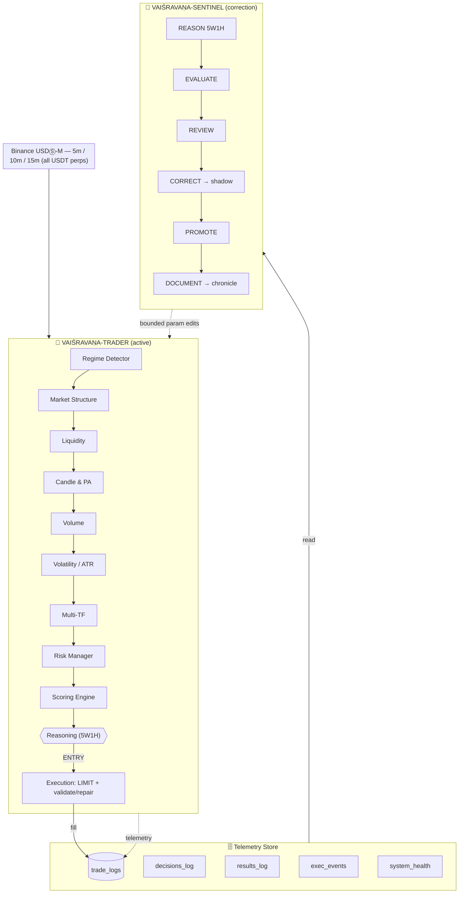
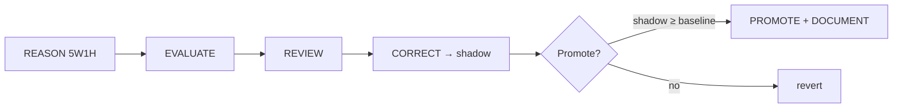

<div align="center">


# 🪙 Project Vaiśravaṇa

### A stability-first, high-win-rate crypto-futures trading system

[](docs/33-paper.md)
[](docs/30-concrete-spec.md)
[](docs/25-safety-shadow-rollback.md)
[](docs/30-concrete-spec.md)
[](docs/30-concrete-spec.md)
[](#no-signals)
[](docs/22-telemetry.md)
[](#attribution)
[](ARCHITECTURE.md)

*Named after **Vaiśravaṇa (वैश्रवण)** — Buddhist deity of wealth and guardian of the northern quarter.
The system's prime directive is the **preservation** of capital through stable, high-probability execution.*

</div>

---

> [!NOTE]
> **This repository is a complete design & knowledge base** — 33 interlinked markdown documents
> covering market theory, a 9-engine architecture, a two-bot self-correcting system, full
> telemetry schemas, and a technical paper. It is **not yet executable code**; the spec is
> implementation-ready.

## ✨ Why Vaiśravaṇa

| ❌ Typical bot failure | ✅ Vaiśravaṇa's answer |
|------------------------|------------------------|
| Reads one candle / one indicator | **Multi-evidence confluence** before any entry |
| Waits for external signals | **No signals** — decides internally, enters immediately |
| Dies on execution quirks | **Production-hardened** order validation & 1000× handling |
| Blind self-tuning | **Bounded** Sentinel + 5W1H reasoning, fully logged |
| No audit trail | **Every** decision, fill, TP, close, win/loss persisted |

## 🎯 Non-Negotiable Goals

| # | Goal | Measure |
|---|------|---------|
| **G1** | Time-sensitive accuracy | Decision→fill < 2s |
| **G2** | Stability | Max drawdown < 3% (unreal & live) |
| **G3** | High win rate (≥85%) | Per-pair/per-TF shadow WR ≥ 85% to go live |
| **G4** | Micro-timeframe trades | 5m / 10m / 15m windows |
| **G5** | All Binance pairs | Full USDT-perp universe, liquidity-filtered |
| **G6** | Shadow-first | Every win/loss recorded in unreal before live |

---

## 🏛️ Architecture at a Glance



> The **9 engines + 1 reasoning layer** are detailed in [`docs/11-bot-architecture.md`](docs/11-bot-architecture.md)
> and [`docs/29-dynamic-reasoning-5w1h.md`](docs/29-dynamic-reasoning-5w1h.md).
> The master design lives in [`ARCHITECTURE.md`](ARCHITECTURE.md).

---

## 🪢 No Signals

<details>
<summary><b>Click to expand — the "no external signal" design choice</b></summary>

The bot **does not wait for, parse, or depend on any external source** (Telegram, webhook, API
signal). It watches the market itself, scores internally via the 9 engines, and **enters
positions immediately** when the confluence gate passes.

This removes an entire failure class:
- signal-source downtime
- parse / regex errors
- delayed or duplicate messages
- "front-running" the signal

The internal decision is persisted to **`decisions_log`** (with a `confidence_pct` column)
*after* the trade is already in — replacing the traditional `signals_log` entirely.

</details>

## 📊 Logging & Auditability

Three mandatory tables (full SQL in [`docs/30-concrete-spec.md §4`](docs/30-concrete-spec.md)):

| Table | Purpose |
|-------|---------|
| **`trade_logs`** | One row per trade that entered. Lifecycle timestamps (`ts_filled`, `ts_tp_hit`, `ts_fully_closed`), **`win`/`loss` booleans**, cumulative **`win_pct`/`loss_pct`** per pair×TF. *Every* trade recorded. |
| **`decisions_log`** | Internal decision + **`confidence`%**. The trade is already "in" when written. |
| **`results_log`** | Historical meta-loop trail: **evaluation / reasoning / thinking / correction / improvement / review**. |

A `correlation_id` threads every table, so a single trade's full life is reconstructable.

[](docs/22-telemetry.md)
[](docs/30-concrete-spec.md)
[](docs/26-documentation-output.md)

---

## 🔧 The Sentinel (autonomous self-improvement)

> [!IMPORTANT]
> The Sentinel **never rewrites engine logic**. It edits only a *bounded parameter surface*
> (weights, thresholds, SL/TP multipliers, leverage, cooldown) — always via shadow-test →
> promote → document.



Guardrails forbid disabling safety filters or reward-hacking (optimising a metric at the
expense of genuine stability). See [`docs/24-review-correction-bot.md`](docs/24-review-correction-bot.md)
and [`docs/25-safety-shadow-rollback.md`](docs/25-safety-shadow-rollback.md).

---

## 🛡️ Stability-First Risk Posture

| Guard | Value |
|-------|-------|
| Max leverage | **2×** (hard cap) |
| Daily loss limit | **0.5%** → kill-switch |
| Risk per trade | **0.25%** of equity |
| Global live pairs cap | **5** |
| Max hold | = trade timeframe (5/10/15m) |
| Kill switches | ADL rank · funding spike · maintenance · frozen feed · black-swan |

> [!WARNING]
> The **+85% win-rate is a gate, not a guarantee.** Pair/timeframe combinations that cannot
> sustain 85% in unreal are *pruned*. Capital is never forced into sub-85% setups.

---

## 📚 Documentation

<details open>
<summary><b>📖 Master Design</b></summary>

| File | Role |
|------|------|
| [**ARCHITECTURE.md**](ARCHITECTURE.md) | **Master design** — goals, principles, component map, MT shadow engine, win-rate strategy |
| [**docs/33-paper.md**](docs/33-paper.md) | **Technical Paper** — abstract, architecture, no-signaling, logging, Sentinel, risk |

</details>

<details>
<summary><b>🧠 Part 1 — 8 Analysis Layers (Signal / Alpha)</b></summary>

| File | Content |
|------|---------|
| [docs/01-market-structure.md](docs/01-market-structure.md) | Layer 1 — Market structure (trend/range/breakout/fake) |
| [docs/02-candlestick-psychology.md](docs/02-candlestick-psychology.md) | Layer 2 — Candlestick psychology |
| [docs/03-momentum.md](docs/03-momentum.md) | Layer 3 — Momentum & overextension |
| [docs/04-volume-confirmation.md](docs/04-volume-confirmation.md) | Layer 4 — Volume confirmation |
| [docs/05-support-resistance.md](docs/05-support-resistance.md) | Layer 5 — Support / Resistance |
| [docs/06-liquidity.md](docs/06-liquidity.md) | Layer 6 — Liquidity (grabs / stop hunts) |
| [docs/07-atr.md](docs/07-atr.md) | Layer 7 — ATR (normal volatility) |
| [docs/08-multi-timeframe.md](docs/08-multi-timeframe.md) | Layer 8 — Multi-timeframe confirmation |
| [docs/09-smart-candle-analysis.md](docs/09-smart-candle-analysis.md) | Smart candle analysis + Decision Tree |
| [docs/10-scoring-system.md](docs/10-scoring-system.md) | Futures signal scoring (weights & thresholds) |
| [docs/11-bot-architecture.md](docs/11-bot-architecture.md) | Layered bot architecture (9 engines) |

</details>

<details>
<summary><b>🤖 Part 2 — Two-Bot System (Auto-Correction / Improve / Review / Evaluate)</b></summary>

| File | Content |
|------|---------|
| [docs/20-meta-system-overview.md](docs/20-meta-system-overview.md) | System overview: Trader + Sentinel, 4 phases |
| [docs/21-active-bot.md](docs/21-active-bot.md) | **Parameter surface** — what Sentinel may change (bounds) |
| [docs/22-telemetry.md](docs/22-telemetry.md) | Trade journal / log schema (Sentinel's eyes) |
| [docs/23-evaluation-engine.md](docs/23-evaluation-engine.md) | Auto-evaluate: metrics + per-factor/regime attribution |
| [docs/24-review-correction-bot.md](docs/24-review-correction-bot.md) | Auto-review + auto-correct + shadow + promote |
| [docs/25-safety-shadow-rollback.md](docs/25-safety-shadow-rollback.md) | Shadow mode, bounds, rollback, kill-switch |
| [docs/26-documentation-output.md](docs/26-documentation-output.md) | Required formats: eval_report / change_proposal / changelog / **chronicle** |
| [docs/27-feedback-loop.md](docs/27-feedback-loop.md) | Daily loop orchestration + triggers |
| [docs/28-unexpected-factors.md](docs/28-unexpected-factors.md) | **Blind-spot research**: 8 groups of unforeseen factors |
| [docs/29-dynamic-reasoning-5w1h.md](docs/29-dynamic-reasoning-5w1h.md) | **Dynamic reasoning**: 5W1H + 5 scenarios + novel hypotheses |
| [docs/30-concrete-spec.md](docs/30-concrete-spec.md) | **CONCRETE SPEC**: stability-first, WR≥85%, micro-TF, all pairs, no signals, full schemas |
| [docs/31-glossary.md](docs/31-glossary.md) | Glossary & cross-reference |
| [docs/32-listener-lessons.md](docs/32-listener-lessons.md) | Enrichment from `learnernoearner-listener` (production patterns) |

</details>

---

## 🚀 Quick Decision Tree (entry)

```text
Trend? ──▶ Bullish?
            └─ Price at support?
                 └─ Bullish candle appears?
                      └─ Volume rising?
                           └─ Momentum sufficient?
                                └─ Spread safe?
                                     └─ OPEN BUY
```

## 📈 Scoring Weights (futures)

| Factor | Weight |
|--------|--------|
| Trend | 30% |
| Momentum | 20% |
| Volume | 15% |
| Market Structure | 15% |
| Liquidity | 10% |
| Volatility (ATR) | 5% |
| Funding / OI | 5% |

- **Score > 0.90** → Entry (A+ confluence, tuned for ≥85% WR)
- **0.80 – 0.90** → Watchlist
- **< 0.80** → Skip

---

## 🤝 Attribution

> [!TIP]
> The README hero image — *"The northern Vaiśravaṇa, Lingsheng Temple"* — is a
> **public-domain (CC0 1.0)** photograph from
> [Wikimedia Commons](https://commons.wikimedia.org/wiki/File:The_northern_Vai%C5%9Brava%E1%B9%87a,_Lingsheng_Temple.jpg).
> No attribution required; included here as the project's namesake.

## 📌 Status

> [!CAUTION]
> **Not financial advice.** This is a research/design knowledge base. Trading crypto
> futures carries total-loss risk. The system is documentation-complete but **not yet
> deployed**. Backtesting, fee-tier calibration, and the concrete DB/language choice remain
> open implementation decisions (tracked in [`docs/31-glossary.md`](docs/31-glossary.md)).

---

<div align="center">

**⭐ If this design is useful, star the repo. Documentation is the strategy.**

</div>
